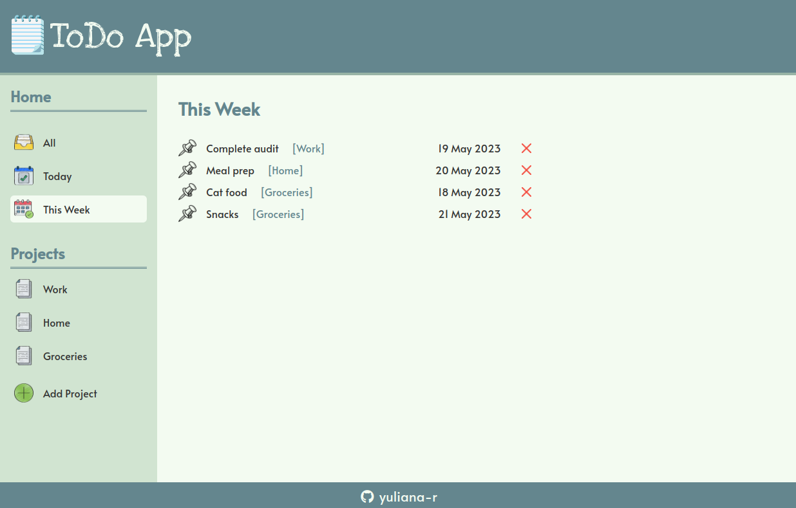

# todo-list

# ToDo List
## Introduction

This project is a web app that stores and lists to-do items. It is built using the standard front-end stack of HTML, CSS, and JavaScript bundled using Webpack.

The project primarily demonstrates use of data structures, as well as use of external libraries to provide or enhance functionality.

## Preview

<!--  -->

## Media & assets credits:

1. Flaticon: https://www.flaticon.com/search?word=todo
